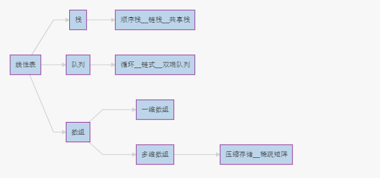
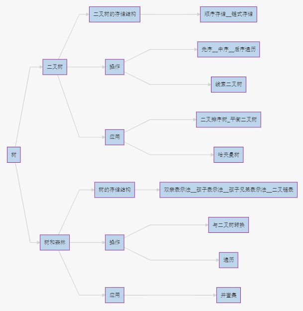
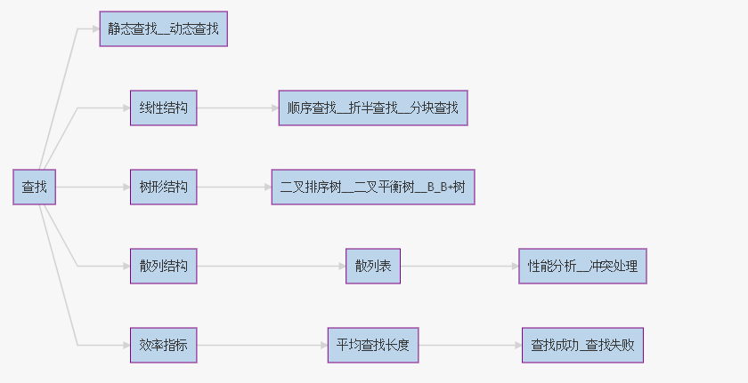
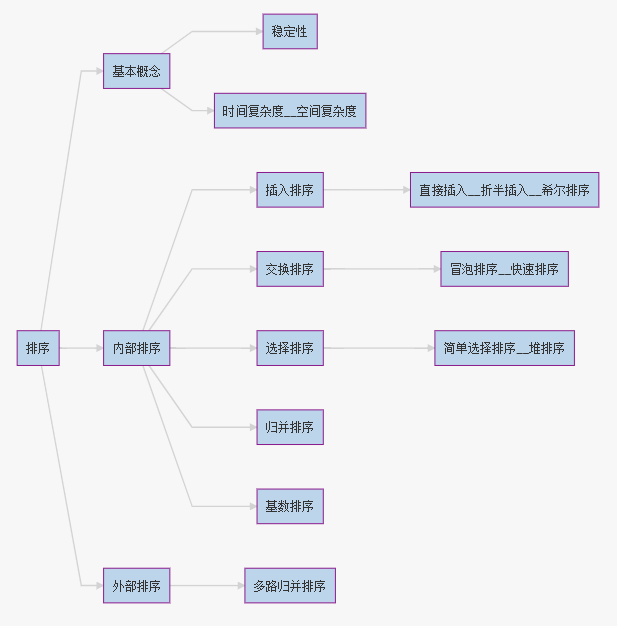
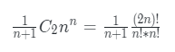
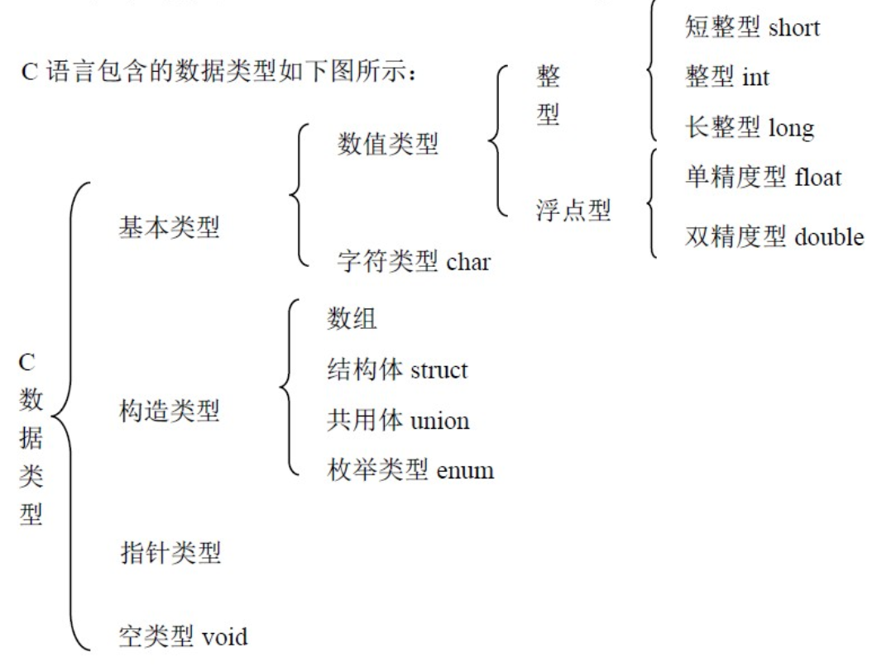
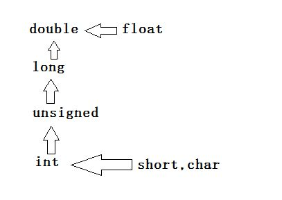

# Data_Structure_Learning
数据结构学习  
VS2015工程文件
- [数据结构](##数据结构)
- [排序](##排序)
- [C](##C)

---

## 数据结构
### 顺序表，链表，栈，队列 
- 循环队列，设A[0...M-1]，front队头指针，rear队尾元素的后一个
    - 队空：front == rear
    - 队满：(rear+1)%M == front
    - 入队：rear = (rear+1) % M
    - 出队：front = (front+1) % M
- n个不同元素进栈，出栈序列个数为（卡特兰数）  

### 树
- 遍历

|树|森林|二叉树|
|:---:|:---:|:---:|
|先根遍历|中序遍历|先序遍历|
|后根遍历|中序遍历|中序遍历|
- 二叉排序树（折半查找的判定树）的中序遍历是一个有序序列
### 图
- 邻接矩阵得到的BFS, DFS序列唯一。邻接表得到的BFS, DFS序列不唯一。 **一般情况下，除去一些特殊的图**
- BFS DFS 复杂度（V-顶点数，E-边数）   
<table>
    <tr>
        <td rowspan="2" align="center">
            <strong> 存储方式</strong>
        </td>
        <td colspan="2" align="center">
            <strong>广度优先遍历(BFS)</strong>
        </td>
        <td colspan="2" align="center">
            <strong>深度优先遍历(DFS)</strong>
        </td>
    </tr>
    <tr>
        <td align="center">时间复杂度</td>
        <td align="center">空间复杂度（辅助队列）</td>
        <td align="center">时间复杂度</td>
        <td align="center">空间复杂度（递归工作栈）</td> 
    </tr>
    <tr>
        <td align="center">邻接矩阵</td>
        <td align="center">O( V^2 )</td>
        <td rowspan="2" align="center">O( V )</td>
        <td align="center">O( V^2 )</td>
        <td rowspan="2" align="center">O( V )</td>
    </tr>
    <tr>
        <td align="center">邻接表</td>
        <td align="center">O( V+E )</td>
        <td align="center">O( V+E )</td>
    </tr>
</table>

- 最小生成树    
    - Prim 
    - Kruskal
- 最短路径

|Dijskra|Floyd|
|:---:|:---:|
|O(V^2)|O(V^3)|
## 排序
|排序方法|平均复杂度|最好复杂度|最差复杂度|辅助空间|稳定性|
|:----:|:----:|:----:|:----:|:----:|:----:|
|冒泡排序|n^2|n|n^2|1|:heavy_check_mark:|
|直接插入|n^2|n|n^2|1|:heavy_check_mark:|
|选择排序|n^2|n^2|n^2|1|:x:|
|希尔排序|nlogn~n^2|n^1.3|n^2|1|:x:|
|快速排序|nlogn|nlogn|n^2|logn~n|:x:|
|堆排序|nlogn|nlogn|nlogn|1|:x:|
|归并排序|nlogn|nlogn|nlogn|n|:heavy_check_mark:|
|基数排序|d(n+r)|d(n+r)|d(n+r)|r|:heavy_check_mark:|
|计数排序|n+k|n+k|n+k|n+k|
- 归并排序  
    一般来说，对于n个元素进行k路归并，排序趟数m满足$k^m=n$，从而$m=log_k^n$，又考虑到m为整数，从而$m=\lceil log_k^n\rceil$
- 复杂度比较  

|f(n)|阶 O( )|函数名|
|:---:|:---:|:---:|
|1|1|常数函数|
|2logn+2|logn|对数函数|
|2n+1|n|线性函数|
|2nlogn+2n+2|nlogn|nlogn函数|
|2n^2+2n+2|n^2|二次函数|
|2n^3+2n+2|n^3|三次函数|
|2^n|2^n|指数函数|

## C
### 指针自加与取值
***工程中有测试程序***    

|形式|含义|
|:----:|:----:|
|x=*p++|取值，指针自加|
|*++p|指针自加，取值|
|++*p|指针所指向的值加1，取值|
|*(p++)|取值，指针自加|
|*(++p)|指针自加，取值|                          
|++(*p)|指针所指向的值加1，取值|
|(*p)++|取值，指针所指向的值加1|
|||
|结构体指针|结构体中含有元素 int e|
|p++->e|取值，指针自加，指向下一个结构体或其他|
|++p->e|指针所指向的值加1，取值|
|p->e++|取值，所指向的值加1|
|(p++)->e|取值，指针自加|
|(++p)->e|指针自加，取值|
### 语法
#### || &&
    int x=1, y=0;
    (x||y=1)        //或，有一个真即可，由于x=1 为真，就不执行y=1
    (x&&y=1)        //且，需要同时为真，执行y=1

### 数据类型   

***一般情况，可能由于机器不同，int类型大小不同***  

|类型|bit|字节|范围|
|:---:|:----:|:---:|:---:|
|int|32|4|-2^31~2^31-1|
|short|16|2|-2^15~2^15-1|
|long|32|4|-2^31~2^31-1|
|unsigned int|32|4|0~2^32-1|
|unsigned short|16|2|0~2^16-1|
|unsigned long|32|4|0~2^32-1
|char|8|1|0~255|
|float|32|4| +- 10^-38~10^38|
|double|64|8| +- 10^-308~10^308|
- 自动类型转换

- ~  

        int a=10, x;
        x=~a;
        printf("%d", x);    // -11
    int 有符号，需要加符号位，a=10，即01010; 取反，x=~a，即10101 为负，在计算机中以补码的形式存在，所以10101除符号位取反为11010，加1为11011，也就是-11
- sizeof strlen
    - strlen 从内存某位置开始扫描字符，知道遇到第一个‘\0’，C语言字符包括数字，字母，可打印的字符，空白符（空格，换行，制表符）
    - sizeof 是实际分配内存大小和数据类型没多大关系 
        - strlen("\n")  -> 1
        - sizeof("\n")  -> 2

### 运算符优先级
<table>
    <tbody>
        <tr>
            <td>
                

                    <strong>优先级</strong>

            </td>
            <td>
                

                    <strong>运算符</strong>

            </td>
            <td>
                

                    <strong>名称或含义</strong>

            </td>
            <td>
                

                    <strong>使用形式</strong>

            </td>
            <td>
                

                    <strong>结合方向</strong>

            </td>
            <td>
                

                    <strong>说明</strong>

            </td>
        </tr>
        <tr>
            <td rowspan="4">
                

                    <strong>1</strong>

            </td>
            <td>
                

                    <strong>[]</strong>

            </td>
            <td>
                

                    数组下标

            </td>
            <td>
                

                    数组名[常量表达式]

            </td>
            <td rowspan="4">
                

                    左到右

            </td>
            <td>
                

                    --

            </td>
        </tr>
        <tr>
            <td>
                

                    <strong>()</strong>

            </td>
            <td>
                

                    圆括号

            </td>
            <td>
                

                    (表达式）/函数名(形参表)

            </td>
            <td>
                

                    --

            </td>
        </tr>
        <tr>
            <td>
                

                    <strong>.</strong>

            </td>
            <td>
                

                    成员选择（对象）

            </td>
            <td>
                

                    对象.成员名

            </td>
            <td>
                

                    --

            </td>
        </tr>
        <tr>
            <td>
                

                    <strong>-&gt;</strong>

            </td>
            <td>
                

                    成员选择（指针）

            </td>
            <td>
                

                    对象指针-&gt;成员名

            </td>
            <td>
                

                    --

            </td>
        </tr>
        <tr>
            <td width="612" colspan="6">
                

                

            </td>
        </tr>
        <tr>
            <td rowspan="9">
                

                    <strong>2</strong>

            </td>
            <td>
                

                    <strong>-</strong>

            </td>
            <td>
                

                    负号运算符

            </td>
            <td>
                

                    -表达式

            </td>
            <td rowspan="9">
                

                    <strong>右到左</strong>

            </td>
            <td rowspan="7">
                

                    单目运算符

            </td>
        </tr>
        <tr>
            <td>
                

                    <strong>~</strong>

            </td>
            <td>
                

                    按位取反运算符

            </td>
            <td>
                

                    ~表达式

            </td>
        </tr>
        <tr>
            <td>
                

                    <strong>++</strong>

            </td>
            <td>
                

                    自增运算符

            </td>
            <td>
                

                    ++变量名/变量名++

            </td>
        </tr>
        <tr>
            <td>
                

                    <strong>--</strong>

            </td>
            <td>
                

                    自减运算符

            </td>
            <td>
                

                    --变量名/变量名--

            </td>
        </tr>
        <tr>
            <td>
                

                    <strong>*</strong>

            </td>
            <td>
                

                    取值运算符

            </td>
            <td>
                

                    *指针变量

            </td>
        </tr>
        <tr>
            <td>
                

                    <strong>&amp;</strong>

            </td>
            <td>
                

                    取地址运算符

            </td>
            <td>
                

                    &amp;变量名

            </td>
        </tr>
        <tr>
            <td>
                

                    <strong>!</strong>

            </td>
            <td>
                

                    逻辑非运算符

            </td>
            <td>
                

                    !表达式

            </td>
        </tr>
        <tr>
            <td>
                

                    <strong>(类型)</strong>

            </td>
            <td>
                

                    强制类型转换

            </td>
            <td>
                

                    (数据类型)表达式

            </td>
            <td>
                

                    --

            </td>
        </tr>
        <tr>
            <td>
                

                    <strong>sizeof</strong>

            </td>
            <td>
                

                    长度运算符

            </td>
            <td>
                

                    sizeof(表达式)

            </td>
            <td>
                

                    --

            </td>
        </tr>
        <tr>
            <td width="612" colspan="6">
                

                

            </td>
        </tr>
        <tr>
            <td rowspan="3">
                

                    <strong>3</strong>

            </td>
            <td>
                

                    <strong>/</strong>

            </td>
            <td>
                

                    除

            </td>
            <td>
                

                    表达式/表达式

            </td>
            <td rowspan="3">
                

                    左到右

            </td>
            <td rowspan="3">
                

                    双目运算符

            </td>
        </tr>
        <tr>
            <td>
                

                    <strong>*</strong>

            </td>
            <td>
                

                    乘

            </td>
            <td>
                

                    表达式*表达式

            </td>
        </tr>
        <tr>
            <td>
                

                    <strong>%</strong>

            </td>
            <td>
                

                    余数（取模）

            </td>
            <td>
                

                    整型表达式%整型表达式

            </td>
        </tr>
        <tr>
            <td rowspan="2">
                

                    <strong>4</strong>

            </td>
            <td>
                

                    <strong>+</strong>

            </td>
            <td>
                

                    加

            </td>
            <td>
                

                    表达式+表达式

            </td>
            <td rowspan="2">
                

                    左到右

            </td>
            <td rowspan="2">
                

                    双目运算符

            </td>
        </tr>
        <tr>
            <td>
                

                    <strong>-</strong>

            </td>
            <td>
                

                    减

            </td>
            <td>
                

                    表达式-表达式

            </td>
        </tr>
        <tr>
            <td rowspan="2">
                

                    <strong>5</strong>

            </td>
            <td>
                

                    <strong>&lt;&lt; </strong>

            </td>
            <td>
                

                    左移

            </td>
            <td>
                

                    变量&lt;&lt;表达式

            </td>
            <td rowspan="2">
                

                    左到右

            </td>
            <td rowspan="2">
                

                    双目运算符

            </td>
        </tr>
        <tr>
            <td>
                

                    <strong>&gt;&gt; </strong>

            </td>
            <td>
                

                    右移

            </td>
            <td>
                

                    变量&gt;&gt;表达式

            </td>
        </tr>
        <tr>
            <td width="612" colspan="6">
                

                

            </td>
        </tr>
        <tr>
            <td rowspan="4">
                

                    <strong>6</strong>

            </td>
            <td>
                

                    <strong>&gt; </strong>

            </td>
            <td>
                

                    大于

            </td>
            <td>
                

                    表达式&gt;表达式

            </td>
            <td rowspan="4">
                

                    左到右

            </td>
            <td rowspan="4">
                

                    双目运算符

            </td>
        </tr>
        <tr>
            <td>
                

                    <strong>&gt;=</strong>

            </td>
            <td>
                

                    大于等于

            </td>
            <td>
                

                    表达式&gt;=表达式

            </td>
        </tr>
        <tr>
            <td>
                

                    <strong>&lt; </strong>

            </td>
            <td>
                

                    小于

            </td>
            <td>
                

                    表达式&lt;表达式

            </td>
        </tr>
        <tr>
            <td>
                

                    <strong>&lt;=</strong>

            </td>
            <td>
                

                    小于等于

            </td>
            <td>
                

                    表达式&lt;=表达式

            </td>
        </tr>
        <tr>
            <td rowspan="2">
                

                    <strong>7</strong>

            </td>
            <td>
                

                    <strong>==</strong>

            </td>
            <td>
                

                    等于

            </td>
            <td>
                

                    表达式==表达式

            </td>
            <td rowspan="2">
                

                    左到右

            </td>
            <td rowspan="2">
                

                    双目运算符

            </td>
        </tr>
        <tr>
            <td>
                

                    <strong>！=</strong>

            </td>
            <td>
                

                    不等于

            </td>
            <td>
                

                    表达式!= 表达式

            </td>
        </tr>
        <tr>
            <td width="612" colspan="6">
                

                

            </td>
        </tr>
        <tr>
            <td>
                

                    <strong>8</strong>

            </td>
            <td>
                

                    <strong>&amp;</strong>

            </td>
            <td>
                

                    按位与

            </td>
            <td>
                

                    表达式&amp;表达式

            </td>
            <td>
                

                    左到右

            </td>
            <td>
                

                    双目运算符

            </td>
        </tr>
        <tr>
            <td>
                

                    <strong>9</strong>

            </td>
            <td>
                

                    <strong>^</strong>

            </td>
            <td>
                

                    按位异或

            </td>
            <td>
                

                    表达式^表达式

            </td>
            <td>
                

                    左到右

            </td>
            <td>
                

                    双目运算符

            </td>
        </tr>
        <tr>
            <td>
                

                    <strong>10</strong>

            </td>
            <td>
                

                    <strong>|</strong>

            </td>
            <td>
                

                    按位或

            </td>
            <td>
                

                    表达式|表达式

            </td>
            <td>
                

                    左到右

            </td>
            <td>
                

                    双目运算符

            </td>
        </tr>
        <tr>
            <td>
                

                    <strong>11</strong>

            </td>
            <td>
                

                    <strong>&amp;&amp;</strong>

            </td>
            <td>
                

                    逻辑与

            </td>
            <td>
                

                    表达式&amp;&amp;表达式

            </td>
            <td>
                

                    左到右

            </td>
            <td>
                

                    双目运算符

            </td>
        </tr>
        <tr>
            <td>
                

                    <strong>12</strong>

            </td>
            <td>
                

                    <strong>||</strong>

            </td>
            <td>
                

                    逻辑或

            </td>
            <td>
                

                    表达式||表达式

            </td>
            <td>
                

                    左到右

            </td>
            <td>
                

                    双目运算符

            </td>
        </tr>
        <tr>
            <td width="612" colspan="6">
                

                

            </td>
        </tr>
        <tr>
            <td>
                

                    <strong>13</strong>

            </td>
            <td>
                

                    <strong>?:</strong>

            </td>
            <td>
                

                    条件运算符

            </td>
            <td>
                

                    表达式1?

                

                    表达式2: 表达式3

            </td>
            <td>
                

                    <strong>右到左</strong>

            </td>
            <td>
                

                    三目运算符

            </td>
        </tr>
        <tr>
            <td width="612" colspan="6">
                

                     

            </td>
        </tr>
        <tr>
            <td rowspan="11">
                

                    <strong>14</strong>

            </td>
            <td>
                

                    <strong>=</strong>

            </td>
            <td>
                

                    赋值运算符

            </td>
            <td>
                

                    变量=表达式

            </td>
            <td rowspan="11">
                

                    <strong>右到左</strong>

            </td>
            <td>
                

                    --

            </td>
        </tr>
        <tr>
            <td>
                

                    <strong>/=</strong>

            </td>
            <td>
                

                    除后赋值

            </td>
            <td>
                

                    变量/=表达式

            </td>
            <td>
                

                    --

            </td>
        </tr>
        <tr>
            <td>
                

                    <strong>*=</strong>

            </td>
            <td>
                

                    乘后赋值

            </td>
            <td>
                

                    变量*=表达式

            </td>
            <td>
                

                    --

            </td>
        </tr>
        <tr>
            <td>
                

                    <strong>%=</strong>

            </td>
            <td>
                

                    取模后赋值

            </td>
            <td>
                

                    变量%=表达式

            </td>
            <td>
                

                    --

            </td>
        </tr>
        <tr>
            <td>
                

                    <strong>+=</strong>

            </td>
            <td>
                

                    加后赋值

            </td>
            <td>
                

                    变量+=表达式

            </td>
            <td>
                

                    --

            </td>
        </tr>
        <tr>
            <td>
                

                    <strong>-=</strong>

            </td>
            <td>
                

                    减后赋值

            </td>
            <td>
                

                    变量-=表达式

            </td>
            <td>
                

                    --

            </td>
        </tr>
        <tr>
            <td>
                

                    <strong>&lt;&lt;=</strong>

            </td>
            <td>
                

                    左移后赋值

            </td>
            <td>
                

                    变量&lt;&lt;=表达式

            </td>
            <td>
                

                    --

            </td>
        </tr>
        <tr>
            <td>
                

                    <strong>&gt;&gt;=</strong>

            </td>
            <td>
                

                    右移后赋值

            </td>
            <td>
                

                    变量&gt;&gt;=表达式

            </td>
            <td>
                

                    --

            </td>
        </tr>
        <tr>
            <td>
                

                    <strong>&amp;=</strong>

            </td>
            <td>
                

                    按位与后赋值

            </td>
            <td>
                

                    变量&amp;=表达式

            </td>
            <td>
                

                    --

            </td>
        </tr>
        <tr>
            <td>
                

                    <strong>^=</strong>

            </td>
            <td>
                

                    按位异或后赋值

            </td>
            <td>
                

                    变量^=表达式

            </td>
            <td>
                

                    --

            </td>
        </tr>
        <tr>
            <td>
                

                    <strong>|=</strong>

            </td>
            <td>
                

                    按位或后赋值

            </td>
            <td>
                

                    变量|=表达式

            </td>
            <td>
                

                    --

            </td>
        </tr>
        <tr>
            <td width="612" colspan="6">
                

                

            </td>
        </tr>
        <tr>
            <td>
                

                    <strong>15</strong>

            </td>
            <td>
                

                    <strong>，</strong>

            </td>
            <td>
                

                    逗号运算符

            </td>
            <td>
                

                    表达式,表达式,…

            </td>
            <td>
                

                    左到右

            </td>
            <td>
                

                    --

            </td>
        </tr>
    </tbody>
</table>

***吐槽***
- Github上的MarkDown不支持表格合并，数学公式，mermaid，只能在本地markdown写出来预览然后截图放上去:confused:
