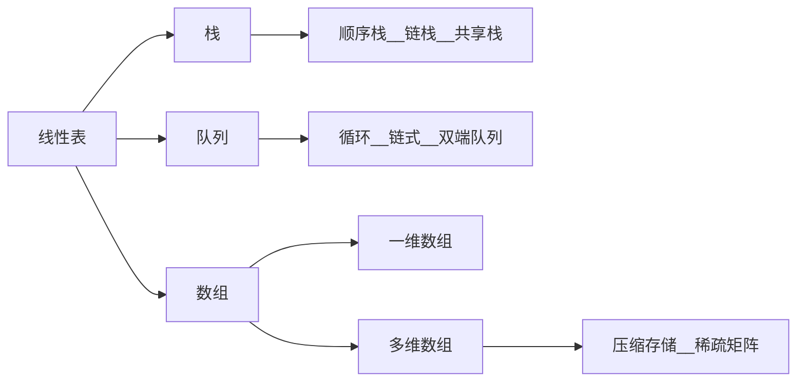
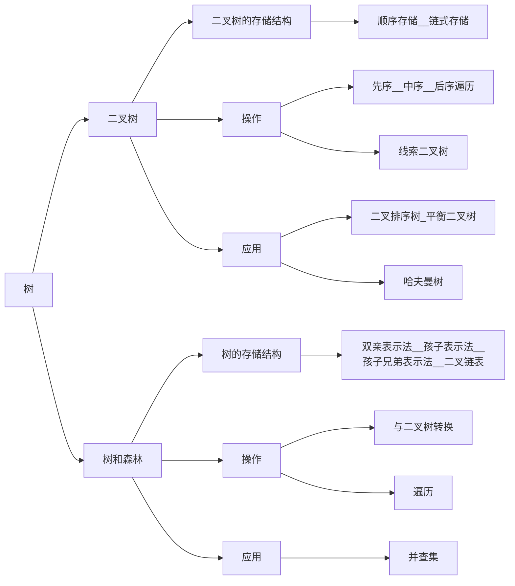
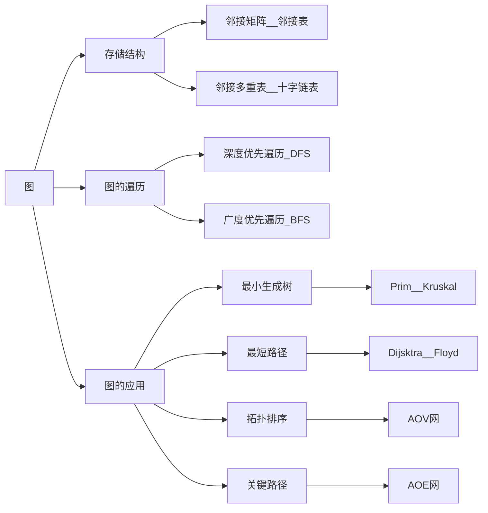
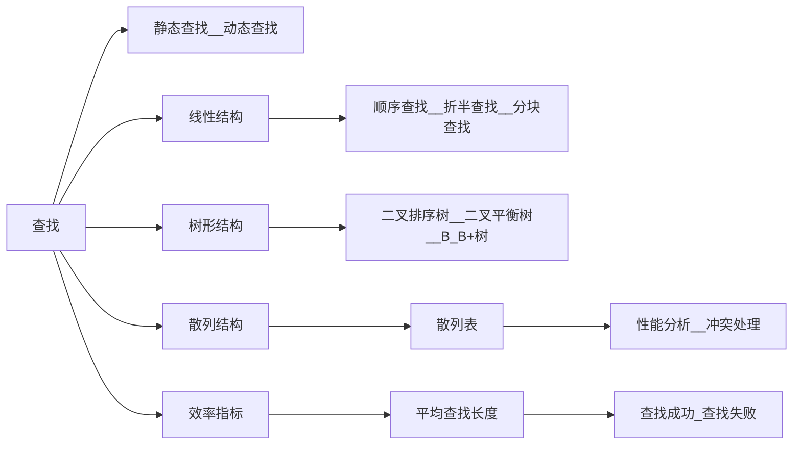
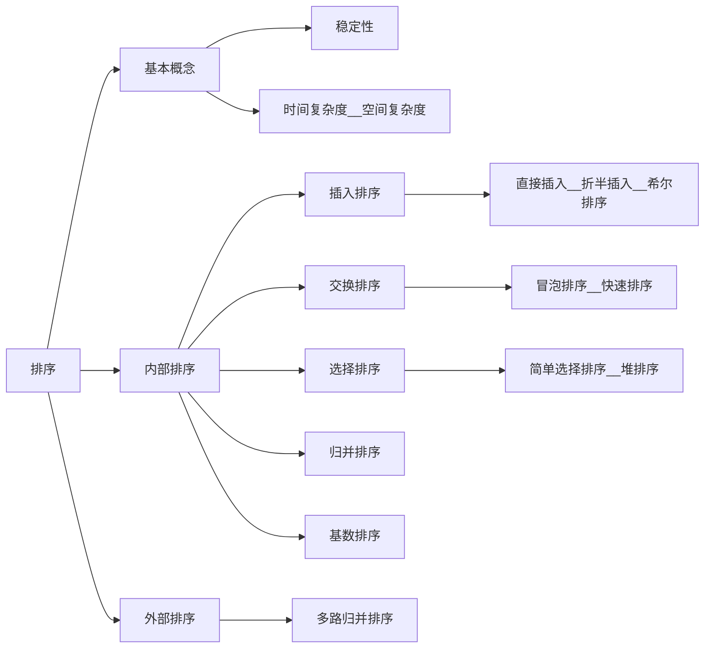

```mermaid
graph LR
    线性表 --> 栈
    线性表 --> 队列
    线性表 --> 数组
    栈 --> 顺序栈__链栈__共享栈
    队列 --> 循环__链式__双端队列
    数组 --> 一维数组
    数组 --> 多维数组
    多维数组 --> 压缩存储__稀疏矩阵
    
```

```mermaid
graph LR
    树 --> 二叉树
    树 --> 树和森林
    二叉树 --> 二叉树的存储结构
    二叉树 --> A1[操作]
    二叉树 --> A2[应用]
    二叉树的存储结构 --> 顺序存储__链式存储
    A1[操作] --> 先序__中序__后序遍历
    A1[操作] --> 线索二叉树
    A2[应用] --> 二叉排序树_平衡二叉树
    A2[应用] --> 哈夫曼树
    树和森林 --> 树的存储结构
    树的存储结构 --> 双亲表示法__孩子表示法__孩子兄弟表示法__二叉链表
    树和森林 --> 操作
    树和森林 --> 应用
    操作 --> 与二叉树转换
    操作--> 遍历
    应用 --> 并查集
```

```mermaid
graph LR    
    图 --> 存储结构 
    图 --> 图的遍历
    图 --> 图的应用
    存储结构 --> 邻接矩阵__邻接表
    存储结构 --> 邻接多重表__十字链表
    图的遍历 --> 深度优先遍历_DFS
    图的遍历 --> 广度优先遍历_BFS
    图的应用 --> 最小生成树 
    图的应用 --> 最短路径
    图的应用 --> 拓扑排序
    拓扑排序 --> AOV网
    图的应用 --> 关键路径
    关键路径 --> AOE网
    最小生成树 --> Prim__Kruskal
    最短路径 --> Dijsktra__Floyd
```

```mermaid
graph LR

    查找 --> 静态查找__动态查找
    查找 --> 线性结构
    查找 --> 树形结构
    查找 --> 散列结构
    查找 --> 效率指标
    线性结构 --> 顺序查找__折半查找__分块查找
    树形结构 --> 二叉排序树__二叉平衡树__B_B+树
    散列结构 --> 散列表
    散列表 --> 性能分析__冲突处理
    效率指标 --> 平均查找长度
    平均查找长度 --> 查找成功_查找失败
```

```mermaid
graph LR
    排序 --> 基本概念
    排序 --> 内部排序
    排序 --> 外部排序
    基本概念 --> 稳定性
    基本概念 --> 时间复杂度__空间复杂度
    内部排序 --> 插入排序
    插入排序 --> 直接插入__折半插入__希尔排序
    内部排序 --> 交换排序
    交换排序 --> 冒泡排序__快速排序
    内部排序 --> 选择排序
    选择排序 --> 简单选择排序__堆排序
    内部排序 --> 归并排序
    内部排序 --> 基数排序
    外部排序 --> 多路归并排序
```